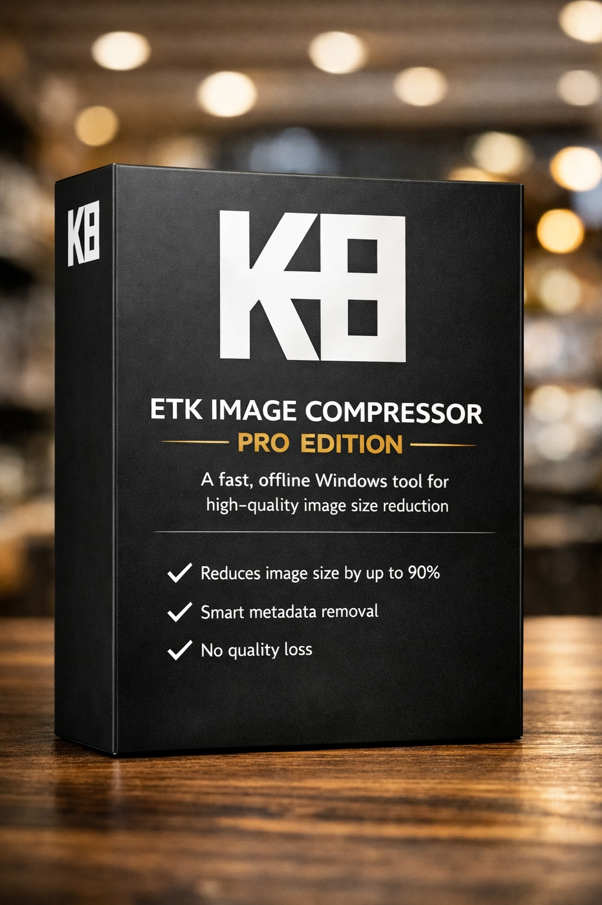

ETK Image Compressor Pro – The world's most powerful image compression algorithm  
Powerful • Offline • Privacy‑Focused

---

✨ What's New in Version 1.1 (2026 Update)

- 🔥 Full support for 8K images (7680×4320)  
- 🖼 New output formats: PNG, WebP, TGA, EXR  
- ⚡ Faster compression engine  
- 🎨 Better color preservation  
- 🧹 Improved metadata cleaner  
- 🛠 Stability improvements  

---

✨ Why ETK Image Compressor Pro?

| Feature | Description |
|--------|-------------|
| 🏆 Strongest Algorithm | The newest and most powerful image compression algorithm in the world |
| 🔒 100% Offline | No images uploaded to servers – complete privacy protection |
| 🖼 8K Image Support | Compress ultra‑high‑resolution images with perfect stability |
| ⚡ Adaptive Speed | Processing speed adjusts to your system's power (manual or auto) |
| 🖥 Old Systems Friendly | Works smoothly even on older hardware |
| 🖼 20+ Formats | JPEG, PNG, WebP, AVIF, HEIC, TIFF and more |
| 🎯 Two Modes | Manual mode (full control) – Quick mode (one click) |
| 🔄 Monthly Updates | New update every month – for 1 full year |
| ♾ Lifetime Access | One payment, lifetime use |

---

📥 Download & Purchase

👉 Buy Pro Version with 66% OFF – Only $10  
https://shakster24.gumroad.com/l/fcnkut

| Version | Price | Discount |
|---------|-------|----------|
| Regular Price | $30 | - |
| Discounted Price | $10 | 66% OFF |
| Discount Code | ETKICP | Valid until May 30, 2026 |

✅ 30-Day Money-Back Guarantee – No Questions Asked

---

🖥 System Requirements

| Requirement | Minimum |
|-------------|---------|
| OS | Windows 7 / 8 / 10 / 11 (64-bit) |
| CPU | 1.5 GHz or faster |
| RAM | 2 GB |
| Storage | 100 MB free space |
| Internet | Not required (offline) |

---

📅 Monthly Update Schedule

| Date | Content |
|------|---------|
| May 1, 2026 | Windows release |
| June 1, 2026 | PNG , WebP , TGA , EXR format support |
| July 1, 2026 | ... format support |
| August 1, 2026 | AVIF format support |
| September 1, 2026 | HEIC format support |
| October 1, 2026 | TIFF format support |
| November 1, 2026 | Speed optimization |
| December 1, 2026 | BMP format support |
| January 1, 2027 | GIF format support |
| February 1, 2027 | New processing mode |
| March 1, 2027 | Algorithm improvement |
| April 1, 2027 | Final yearly update |

📌 Free updates for 1 year (until May 2027).

---

🎮 Two Processing Modes

| Mode | Description |
|------|-------------|
| 🎯 Quick Mode | One click – software automatically chooses best settings |
| 🎛 Manual Mode | Full control over quality, resolution, metadata, and advanced settings |

---

💪 Algorithm Power

- Reduce size by up to 90% with near‑zero quality loss  
- 35% better than JPEGmini Pro (video proof available)  
- 5× faster than base version  
- Batch processing – compress entire folders while preserving structure  
- Metadata removal – EXIF, GPS, camera info  
- 8K image support (new)  

---

📧 Contact & Support

- Support Email: atshak69@gmail.com  
- Response Time: 24 hours (Priority for Pro users)  
- Guarantee: 30-day money-back – no questions asked  

---

⭐ Support

If you like ETK Image Compressor Pro:

- ⭐ Star this repository  
- 🐛 Report bugs in Issues  
- 📢 Share with your friends  

---

© 2026 ETK Image Compressor Pro – All Rights Reserved.
