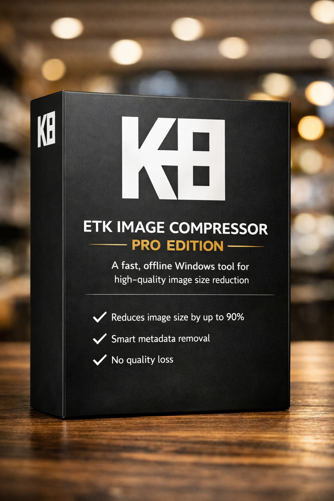

# ETK Image Compressor Pro

### The World's Most Powerful Image Compression Algorithm

**Powerful • Offline • Privacy-Focused**

---

## 🔗 Official Links & Social Media

| Platform | Link |
| :--- | :--- |
| 📦 **GitHub — Release / Download** | [ETK Image Compressor Pro](https://github.com/atshak69-alt/ETK-Image-Compressor-Pro) |
| 🎥 **YouTube — Test Videos** | [@atshak-o2p](https://youtube.com/@atshak-o2p?si=3CIaHKeZLzQFRXEC) |
| 📸 **Instagram — Before/After Samples** | [@etk_official_](https://www.instagram.com/etk_official_) |
| 🏪 **Microsoft Store** | [Get ETK Image Compressor Pro](https://apps.microsoft.com/detail/9nfrrktwqwcr) |

---

## 🛒 Official Purchase Links

### 🟩 Shoppy

**Always the lowest price + always discounted**

[🛒 Buy on Shoppy](https://shoppy.gg/product/UloCnHv)

### 🟧 Gumroad

[🛒 Buy on Gumroad](https://shakster24.gumroad.com/l/fcnkut)

---

# ✨ What's New in Version 1.5

### 🧰 All-New Pro Tools Suite — Premium Only

Three professional tools have been added:

- 🚀 **AI Upscaler**
- 💾 **ETK Image Saver**
- 🔐 **ETK Secure Transfer**

### 🚀 AI Upscaler — Premium Only

True AI-based **4× image enlargement** with:

- Tile-by-tile processing
- Automatic content detection
- Skin and face protection
- Hair and fabric protection
- Text and edge protection
- Bokeh and natural blur preservation
- Portrait detection
- Group-photo detection
- Architecture detection
- Document detection
- Night-photo processing
- Old-scan processing
- Texture and pattern enhancement
- Adaptive preprocessing
- Noise reduction
- Automatic hardware optimization
- PNG output
- Folder selection
- Progress display

### 💾 ETK Image Saver — Premium Only

A proprietary `.etk` format designed for compression and AI reconstruction.

- Smart compression
- AI reconstruction when opening
- Blur maps
- Line maps
- Face maps
- Detail maps
- Automatic quality adjustment
- Automatic downscale control
- Content protection
- Older-version compatibility
- Archiving support
- Transfer support

### 🔐 ETK Secure Transfer — Premium Only

Secure image transfer using:

- `.etktoken` token files
- `.etkimage` encrypted image files
- Device-locked transfers
- Multi-image packages
- ETK compression before encryption
- PNG reconstruction at destination
- Confidential image sharing

### 🔥 ETK+ Format

Proprietary ultra-compression engine for JPG and WebP.

**40–60% smaller than standard JPG and WebP in supported cases.**

### 🛠 Pixel Repair Engine

Automatically detects and reconstructs corrupted pixels and compression artifacts.

### 🎨 Gradient Correction

Preserves smooth color transitions even under high compression.

### 📦 Full Format Support

- PNG — 24-bit / 32-bit / 8-bit / Grayscale
- JPG — Normal / Gray / ETK+
- WebP — Lossy / Lossless / ETK+
- GIF — Standard / Transparent
- TIFF — Standard / Alpha / Grayscale16

### 🖼 18 Output Modes

Choose the output mode that best fits your workflow.

### ⚡ Ultra-Fast Processing

**33 images in 33 seconds on a Core i2 with 2 GB RAM.**

See the test videos for demonstration.

### 🔊 Noise Reduction

Smart denoising while maintaining image sharpness.

### 🔧 Stability Improvements

Improved memory management and crash prevention.

### 🧹 Improved Metadata Cleaner

Removes:

- EXIF
- GPS information
- Camera information

---

# ✨ Why ETK Image Compressor Pro?

| Feature | Description |
| :--- | :--- |
| 🏆 **Powerful Algorithm** | Advanced image compression powered by the ETK+ engine |
| 🔒 **100% Offline** | Images are processed locally without uploading them to servers |
| 🖼 **8K Image Support** | Designed for ultra-high-resolution images |
| ⚡ **Adaptive Speed** | Processing speed adjusts to available system resources |
| 🖥 **Old Systems Friendly** | Designed to work on older hardware |
| 🖼 **20+ Formats** | JPEG, PNG, WebP, AVIF, HEIC, TIFF, GIF, BMP, TGA, EXR and more |
| 🎯 **Two Processing Modes** | Quick Mode and Manual Mode |
| 🧰 **Pro Tools Suite** | AI Upscaler, ETK Image Saver and ETK Secure Transfer |
| 🔄 **Monthly Updates** | Regular feature and stability updates |
| ♾ **Lifetime Access** | One-time purchase with lifetime access |
| 🧩 **Pixel Repair** | Automatic pixel and artifact repair |
| 📊 **ETK+ Exclusive** | Proprietary compression technology for JPG and WebP |

---

# 🏆 ETK+ — The Next Generation of Compression

**ETK+** is our proprietary compression engine designed for substantial file-size reduction while maintaining visual quality.

| What ETK+ Does | How It Benefits You |
| :--- | :--- |
| 🎯 **Massive Size Reduction** | 40–60% smaller than standard JPG and WebP in supported cases |
| 🔧 **Pixel Repair** | Detects and repairs corrupted pixels and compression artifacts |
| 🎨 **Smoother Colors** | Corrects color banding and uneven gradients |
| ✨ **Detail Preservation** | Preserves sharp edges and fine textures |
| 🧹 **Noise Reduction** | Reduces unwanted grain and noise |
| ⚡ **Quality Optimization** | Can produce visually cleaner results by reducing existing artifacts |
| 🖥 **Efficient Processing** | Designed for systems with limited hardware resources |
| 📦 **JPG & WebP ETK+** | Advanced compression with optional transparency support |

> **ETK+ doesn't just compress your images — it repairs, enhances and optimizes them while reducing file size.**

---

# 🧰 ETK Pro Tools Suite

## 🔒 Premium Only

The complete **Pro Tools Suite** is available exclusively in the Premium version of ETK Image Compressor Pro.

---

## 🚀 AI Upscaler

### Professional AI-powered 4× image enlargement

ETK AI Upscaler provides AI-based image enlargement with intelligent content protection.

| Feature | Description |
| :--- | :--- |
| 🧠 **AI Reconstruction** | AI-based 4× image enlargement |
| 🔲 **Tile Processing** | Processes large images tile by tile |
| 🧩 **Seam Protection** | Reduces visible tile seams |
| 👤 **Face Protection** | Protects facial structure and skin |
| 💇 **Hair Protection** | Preserves hair details |
| 👗 **Fabric Protection** | Protects clothing textures |
| 📝 **Text Protection** | Preserves text and sharp edges |
| 🌫 **Bokeh Protection** | Maintains natural blur and bokeh |
| 🏛 **Content Detection** | Detects portraits, architecture and other image types |
| 🌙 **Night Processing** | Adaptive processing for night images |
| 📄 **Document Processing** | Optimized processing for documents |
| 🔍 **Detail Enhancement** | Enhances lines, patterns and textures |
| 🔇 **Noise Reduction** | Adaptive noise reduction |
| ⚙️ **Hardware Optimization** | Automatically adjusts processing for different systems |
| 🖼 **PNG Output** | High-quality PNG output |

---

# 💾 ETK Image Saver

### Proprietary `.etk` format with AI reconstruction

ETK Image Saver introduces the proprietary **ETK image format**.

| Feature | Description |
| :--- | :--- |
| 📦 **`.etk` Format** | Proprietary image storage format |
| 🧠 **AI Reconstruction** | Reconstructs image details when opened |
| 🌫 **Blur Maps** | Stores blur information |
| 📏 **Line Maps** | Stores line information |
| 👤 **Face Maps** | Stores facial information |
| 🔍 **Detail Maps** | Stores important detail information |
| ⚙️ **Automatic Settings** | Adjusts quality and processing parameters |
| 🛡 **Content Protection** | Protects important image structures |
| 🗄 **Archiving** | Suitable for long-term image storage |
| 📤 **Transfer** | Designed for efficient image transfer |

---

# 🔐 ETK Secure Transfer

### Secure image transfer with token-based encrypted packages

ETK Secure Transfer uses:
.etktoken
.etkimage

# Features
🔐 Encrypted image packages
🔑 Token-based transfer
🖥 Destination-device locking
🖼 Multiple images per package
📦 ETK compression before encryption
🖼 PNG reconstruction at destination
🔒 Designed for confidential image sharing

#🖥 System Requirements
Windows 7 / 8 / 10 / 11 — 64-bit
CPU 1.5 GHz or faster
RAM 2 GB
Storage 300 MB free space

# 🎮 Two Processing Modes
🎯 Quick Mode:
One click — software automatically chooses appropriate settings
🎛 Manual Mod:
Full control over quality, resolution, metadata and advanced settings

# 💪 Algorithm Power
📉 Reduce file size by up to 90% with near-zero quality loss in supported ETK+ cases
⚡ 5× faster than the base version
📁 Batch processing for entire folders
🗂 Preserves folder structure during batch processing
🧹 Metadata removal — EXIF, GPS and camera information
🖼 8K image support
🧩 Pixel repair for damaged pixels and compression artifacts
📦 18 output modes
🔥 ETK+ support for JPG and WebP
🚀 AI Upscaler — Premium Only
💾 ETK Image Saver — Premium Only
🔐 ETK Secure Transfer — Premium Only

# 📧 Support Email
atshak69@gmail.com
# ⏱ Response Time
Within 24 hours

© 2026 ETK Image Compressor Pro All Rights Reserved.
